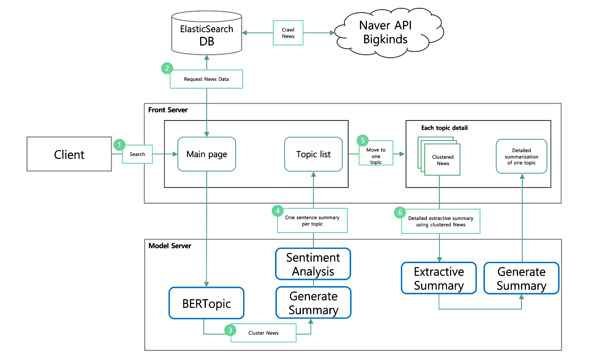
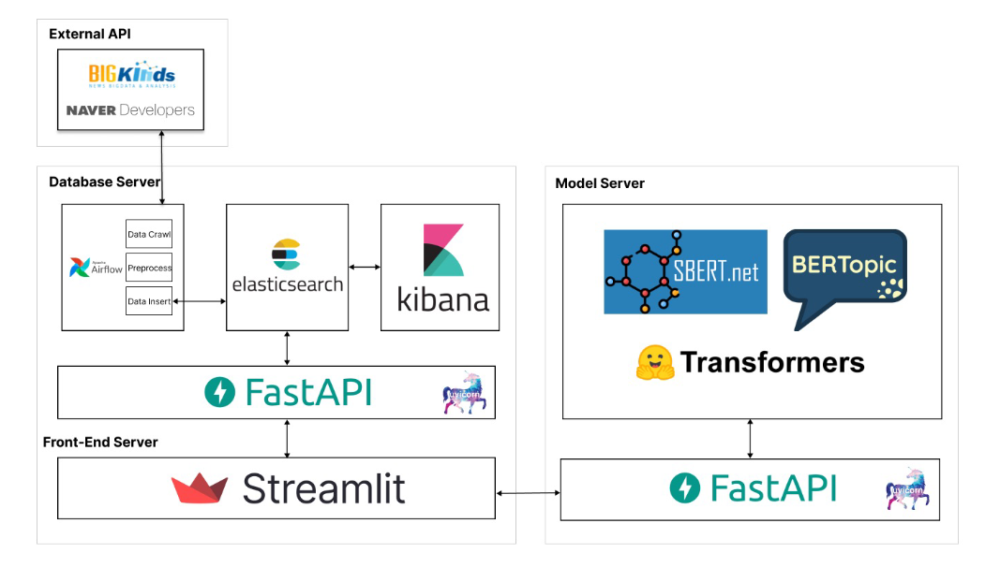
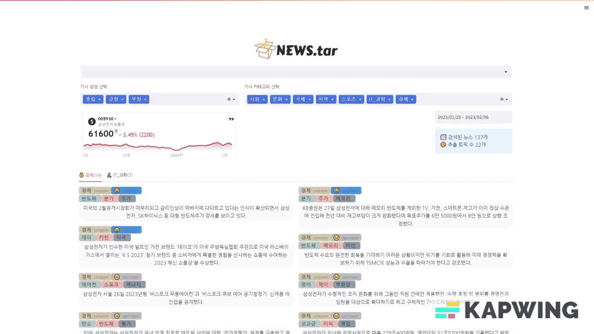

# 📰 NEWS.tar 

## Table of content

* Intro : 팀 소개/ 프로젝스 소개(문제 정의) / 개발 목표
* Dataset & Model: 데이터셋 / 모델 / 연구 / 최종 적용 모델
* Product Serving: 아키텍쳐/ 구현/ 데모
* Result / Conclusion: 시연 영상 / 후속 개발 및 연구 / 결과 및 고찰
* Appendix: 도전적인 실험 / 레슨런 / 예상 Q&A

## Intro

### “한눈에 파악하는 기업뉴스 NEWS.tar"
###### NEWs.tar는 뉴스 데이터를 주제 별로 분류하고 기사 내용을 요약하여 보여줌으로써 사용자들이 짧은 시간에 주요 뉴스 내용을 파악할 수 있도록 도와줍니다.*
 

### Motivation and Objective
✔️ 뉴스데이터는 양이 방대하고 쉽게 구할 수가 있음 
✔️ 하지만 투자를 하고 싶어 기업 관련 뉴스를 검색하면 너무나 많은 정보들이 제공이됨 
✔️ 이러한 뉴스데이터를 클러스터링 & 요약해서 **특정 기업에 대한 주제를 빠르게 파악하고 싶음**

- 비슷한 주제의 뉴스를 모아서 제공
- 각 주제의 기사들을 하나의 문장으로 요약
- 해당 주제에 대한 감정 분석 제공
- 같은 주제로 묶인 기사들의 전반적인 요약 문단 제공
 

### Team member
김진호                       |  신혜진                   |  이효정                    |  이상문                    |  정지훈                    |
:-------------------------:|:------------------------:|:------------------------:|:------------------------:|:-------------------------:
    |   |   || 
| 토픽 모델링  | 본문 추출 요약   한줄 생성 요약| 프론트, 백엔드   한줄 요약 감성 분석|뉴스 데이터 수집   DB 구축| 한줄 생성 요약   유사도 분류

## Dataset & Model

### ⚙️ flow overview

### 💾 dataset
- Naver developer api와 bigkinds의 뉴스데이터를 활용해서 뉴스 본문 데이터 수집
- 2022.11.01 ~ 2023.02.03 기간의 총 66만건의 데이터 수집
- 수집한 데이터는 전처리 과정을 거쳐 ElasticSeach에 Insert

### 🧠 Model

#### 토픽모델링(BERTopic)
- BERTopic은 Document들을 Embedding 모델을 거쳐 이후의 단계를 거친 후 TF_IDF를 통하여 document를 topic별로 클러스터링 함
- Embedding 모델에 대한 실험을 진행하였고 Paraphrase mpnet을 사용

| Embedding Model            | Shilhoutte Score                    | Speed(sec)    |
| ------------------ | ----------------------- |-------|
| Paraphrase mpnet | **0.7585** | 7.34 |
| KR-SBERT | 0.7439 | 6.68 |
| DistillBERT | 0.7012| 7.88 |
| Paraphrase MiniLM | 0.6994 | **5.81** |
| QA mpnet | 0.6927 |11.16|

#### 토픽 한 줄 요약(Generative summary)
- 각각의 기사의 제목과 본문 앞 2문장을 Concat하고 같은 주제로 클러스터링 된 기사들을 Concat 하여 모델의 입력으로 넣음
- KoBART 모델을 활용하여 하나의 토픽에 대해서는 하나의 한줄 요약문 생성

| Embedding Model            | Rouge-1(F1)     | Rouge-2(F1)    | Rouge-3(F1)     | Length    | Speed(sec)    |
| ------------------ | ----------------------- |-------|------------------ | ----------------------- |-------|
| kobart-summarization |  **0.495** | **0.339** | **0.413** | 115.83 | **0.46** |
| KR-SBERT |  **0.495** | 0.329 | 0.385 | 201.49 | 3.19 |
| DistillBERT |  0.488 | 0.324 | 0.394 | 180.29 | 0.64 |

#### 감성  분석(Sentimental analysis)
- 토픽별로 생성된 각각의 문장에 대하여 Sequence Classification Model에 입력으로 넣음
- Positive, Neutral, Negative 3종류의 Class로 분류
- roberta-large 모델을  사용

|Model | Loss |AUPRC |Micro F1 |Speed(sec) |Easy data (#48) | Medium data(#22) |Hard data (#23) |Total data (#93)|
| ------------------ | ----------------------- |-------|---------- | ---------------- |-------|------------- | ------------- |-------|
|roberta-large | **0.4667** | **88.1713** | **82.7956** | 0.7371 | **43** | **18** | **16** | **77** |
|roberta-base 1 | 0.9074 | 87.4126 | 76.3440 | 0.2793 | 42 | 17 | 12 | 71 | 
|roberta-base 2 | 0.5078 | 88.6208 | 78.4946 | **0.2668** | 42 | 14 | 17 | 73 |
|KorFinASC-XLM-RoBERTa | 4.3266 | 29.8050 | 32.2580 | 0.8201 | 14 | 7 | 7 | 28 |

#### 토픽 내 뉴스  요약(Extractive summary)
- 사용 추출 요약 모델 : KorBertSum
- Etri에서 제공하는 pretrained 한국어 BERT 언어모델을 AIHub의 추출요약 데이터셋으로 학습
- 하나의 토픽으로 클러스터링 된 뉴스기사들에서 중요한 문장들만 추출하여 요약 실행

| Model | Rouge-1(F1) | Rouge-2(F1) | Rouge-3(F1) | Rouge-1(Recall) | Rouge-2(Recall) | Rouge-3(Recall) |
| ------------------ | ----------------------- |-------|------------------ | ----------------------- |-------|-------|
|  Etri pretrained model | 0.7550 | 0.5944 | 0.7045 | 0.7213 | 0.5661 | 0.6714|
| AIHub data fine-tuned model | 0.7834 | 0.6365 | 0.7295 | 0.7969 | 0.6467 | 0.7421|

## Product Serving

### Architecture

- 모든 서버는 aistage 서버(V100)  활용
- Database Server
  * Naver Developer api 와 bigkinds 뉴스데이터를 크롤링 & 전처리 & ElasticSearch에 삽입
  * Kibana를 이용하여 데이터의 상태 가시화
  * Airflow를 이용하여 새로운 데이터 처리 및 추가 작업 자동화
- Frontend Server
  * Streamlit으로 Frontend server 운용
  * Client의 query를 Database server로 요청
  * Database의 응답을 Model server로 전달 후 응답 수신
- Model Server
  * Frontend Server에서 오는 요청 수행 후 응답

### Demo
* 유저의 query를 받아 관련된 뉴스를 토픽별로 클러스터링 & 한줄 생성 요약 (ex. 삼성전자)

* 한줄로 요약된 클러스터된 토픽 클릭 -> 클러스링된 뉴스들을 추출 요약

## Result / Conclusion

### 시연영상
[영상 추가 필요]

### Conclusion & 후속 개발
[파일로 추가 예정]

## Appendix

[파일로 추가 예정]

### 레슨런
* 실제 서비스를 구축한다는 생각으로 데이터 파이프라인 구축 및 자동화 작업

### 예상 Q&A
* 실제 서비스라면 데이터에 대한 저작권 및 그 비용은?

## Reference
- Grootendorst, Maarten. "BERTopic: Neural topic modeling with a class-based TF-IDF procedure." arXiv preprint arXiv:2203.05794 (2022).
- Malo, Pekka, et al. "Good debt or bad debt: Detecting semantic orientations in economic texts." Journal 
of the Association for Information Science and Technology 65.4 (2014): 782-796.
- Lewis, Mike, et al. "Bart: Denoising sequence-to-sequence pre-training for natural language generation, translation, and comprehension." arXiv preprint arXiv:1910.13461 (2019).
- Lee, Dongyub, et al. "Reference and document aware semantic evaluation methods for Korean language summarization." arXiv preprint arXiv:2005.03510 (2020).
- Liu, Yang, and Mirella Lapata. "Text summarization with pretrained encoders." arXiv preprint arXiv:1908.08345 (2019).
